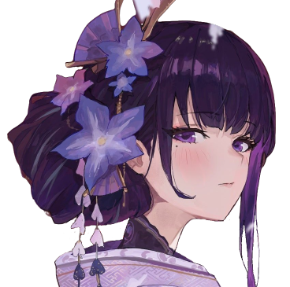
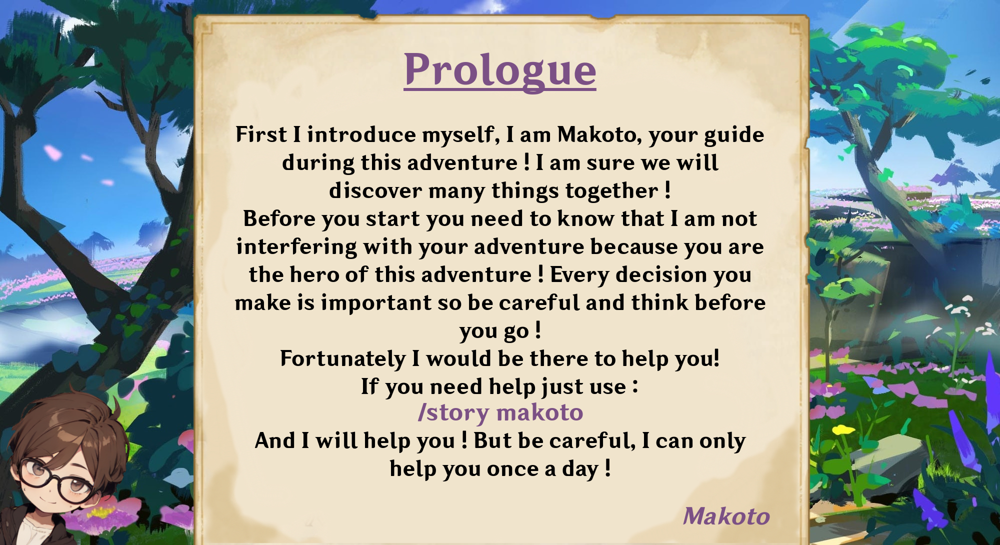

<a name="readme-top"></a>


<br />
<div align="center">
   

  <h3 align="center">Raiden Shogun Discord Bot</h3>

  <p align="center">
    Have you ever wanted to live like Inazuma on Discord ?
    <br />
    I'm also speaking French little cutie...
    <br />
    <a href="https://raidenshogun.gitbook.io/docs"><strong>Documentation</strong></a> · <a href="https://discord.gg/2AePNcphrs"><strong>Discord Server</strong></a>
    <br />
    <br />
  </p>
</div>

## Discover Me

⚠️ **STILL IN DEVELOPMENT, NOT FINISHED YET**

⚠️ I'm a Young Student Developer that create this by himself so my code work but can be a lot different about what real dev do and not optimized at all !

So... Hello ! I'm Raiden Shogun Discord Bot ! Created by Makoto#7116, my goal was to recreate the Genshin Impact Story in Inazuma on Discord. I can fetch your Personal Info in the real game also, with me you are going to discover Inazuma with a new guide named : Antoine and visit Inazuma in a different way, complete quests and chapters, view your daily quests, heal yourself by using statues, meet bosses and fight them, collect materials and earn characters to be more powerful in battle ! I'm also in Development and not finished so errors and problems can appear sometimes :3.

<p align="center">
  
</p>


## Languages Used

Raiden Shogun Bot was :

[](https://www.python.org/)

Using :

[![Json][JSON]][JSON-url]
[![Mysql][MySQL]][MySQL-url]


## Getting Started

Clone the Repository and open it on your IDE.
   ```sh
   git clone https://github.com/CodingMakoto/Raiden-Shogun-Discord-Bot.git
   ```


## License

 [](https://www.gnu.org/licenses/gpl-3.0)

Distributed under the GNU General Public License v3.0. See `LICENSE` for more informations.


## Contact

For any questions we invite you to join us on the [Discord Server](https://discord.gg/2AePNcphrs).

Also you can post your issue if you have one on this repository issue page.

[raiden-example]: images/example.jpeg

[JSON]: https://img.shields.io/badge/Json-f7df1e?style=for-the-badge&logo=json&logoColor=383838
[JSON-url]: https://json.org/

[MySQL]: https://img.shields.io/badge/MySQL-005B75?style=for-the-badge&logo=mysql&logoColor=F3A01F
[MySQL-url]: https://www.mysql.com/
